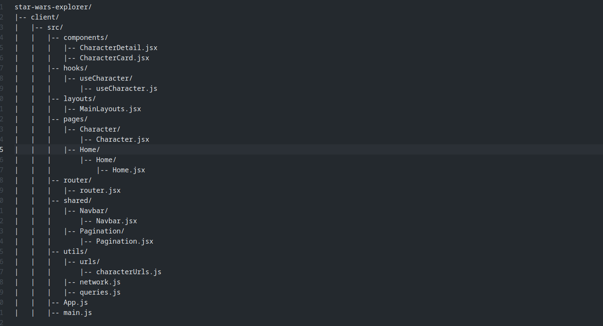

# **Installaction Gideline**

### Stape 01 :

` Clone Git Repository :`

```
git clone https://github.com/codewithashim/Star-Wars-Clients.git
```

### Stape 02 :

` Install Dependancy :`

`cd/client`

```
npm install
```

### Stape 03 :

`Start The Project :`

```
npm run dev
```

# **Project Live Link**

[Live ]()

# **Project Server Installaction**

`Clone Git Repository :`

```
git clone https://github.com/codewithashim/Star-Wars-Server.git
```

### Install Dependancy

`cd/server`

```
npm install
```

### Start The Server

```
nodemon server
```

# API Live Server Link

[API Live Server]()

# API List

| S. No | Base URL                      | API Endpoint                         | Method |
| ----- | ----------------------------- | ------------------------------------ | ------ |
| 01    | http://localhost:5000/api/v1/ | characters?page=${page}              | GET    |
| 02    | http://localhost:5000/api/v1/ | /characters/search?q=${searchQuery}` | GET    |


---

# Project Stracture

### Clients Stracture


